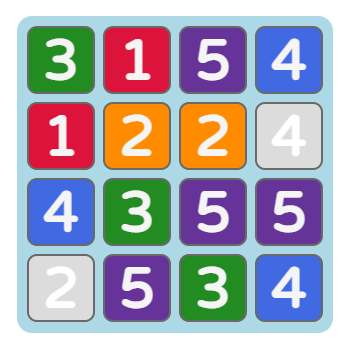
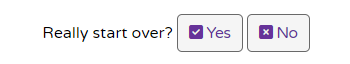

# Quadulo

Quadulo is a point-and-click logic game which incorporates strategic forward-thinking with minor elements of luck, progressively becoming more difficult as the player suceeds within the game.

[LIVE LINK TO SITE](https://ndsurgenor.github.io/quadulo)

The main aims of the site are as follows:
- to provide an challenging game which runs in an internet browser
- to provide a game incoporates basic logic so the user feels in control of their decisions 
- to provide a game which becomes more diffcult as it progresses so as to engage the user
- to present a game whiere the graphic design provides clear feedback and complements the gameplay

## Initial Development

Three user stories were created at the outset of this project to guide its initial design and provide goals for the finished project:
- User A: as someone who enjoys casual gaming, I want to play a simple logic puzzle so I can enjoy a light to medium challenge.
- User B: as someone who plays only mobile games, I want a bright and colourful game that plays quickly so I can play it mobile in short bursts.
- User C: as someone who enjoys strategic games, I want something easy to learn with depth so I can continue to engage with the game more as I get to know it better.

The intial design ideas were developed using interactive prototyping site [Uizard.io](https://app.uizard.io/p/347766d4) and can be viewed by following the link.

Originally the idea revolved around using a 5x5 grid with a aim to creating rows/columns of 5 but this was too complex/long in its gameplay (failing users A & B) while, somewhat paradoxically, also being too simple in its objective (failing user C); as such, the grid was reduced to 4x4 and introduced the objective of continuing for as long as possible.

## Features 

### Existing Features

- __Title__

  - Placed at the top of the index and 404 pages, the title is centrally located to emphasise the name and branding of the game.
  - Clicking the logo will not refresh/redirect the page as this would interupt the game experience.
  - No navigation bar is provided as this site has a one-page focus; interaction occurs through means of a clickable grid/buttons.
  - A text banner under the title provides useful feedback to the user as to the current state of the game.

- __Info Banner__

  - At the outset of the game, the banner instructs the user saying 'Click any 1 to begin' [Fig A].
  - In the course of normal game play, the banner will show which number must be selected next alongside the current upper limit [Fig B].
  - Clicking an unavailable block (empty or greyed-out) will display the message 'Block unavailable. Select a {required number}' [Fig C].
  - Clicking an incorrect number will display the message 'Next number must be {required number}' [Fig D].
  - When no more moves are possible i.e. the required number is not available, the text displays 'Required {required number} is unavailable' [Fig E].
  - If the user tries to select a block when the game is over, the message 'Click New Game to start over' appears as a reminder [Fig F].
  - Messages are formatted consitently with colours and styles of blocks/buttons in the game area (see following).

- __Game Area__

  - Blocks within the grid feature high contrast background colours for ease of readability.
  - Blocks are also coloured in order to convey important gameplay info to the user:
    - 1, 2, 3, and 4 are consistently styled with specific colours - crimson, darkorange, forestgreen and royalblue, respectively - as they are the main focus of gameplay.
    - 5 to 9 are consistently styled with the background colour rebeccapurple as they cannot be selected by the user.
    - Empty cells have a background colour identical to that of the grid (lightblue).
    - Unavailable cells use a background colour (gainsboro) to show they are greyed-out.
  - When using a mouse, hovering over a particular block will provide feedback to the user by highlighting its border.
  - Cursor styles are also used provide feedback: a 'pointer/hand' for available blocks and a 'not allowed' style for those which are unavailable.

- __Level & Block Counters__

  - Feedback regarding progress is given via the 'Level' and 'Blocks cleared' counters located under the grid.
  - For every 16 blocks cleared the Level counter increases by one giving the user a short term goal and keeping them engaged.
  - This level increase also corresponds to the increase of the limit displayed in the info banner (up to a maximum of 9).

- __New Game & Rules Buttons__

  - These buttons (indeed all within the game) are formatted so as to change their visual style when hovered over.
  - Icons used in conjunction with the button text provide a visual metaphor for the user as to their function.
  - The 'New Game' button allows the user to abandon their current game and start afresh.
  - When 'New Game' is selected, a confirmation dialog will appear so that the current game is not interupted accidentally.
  - This dialog does not appear when 'New Game' is clicked alongside the 'GAME OVER' message allowing the user to start a new game immediately.
  - The 'Rules' button displays the rules text over the main game area.  

- __Rules__ 

  - Various headers and paragraphs help to orgnaise and divide up what is a substansial amount of text for the user.
  - The main aim of the game is clearly stated at the top of the rules text so the user knows immediately what they are trying to achieve.
  - The rest of the text is split into two sections to make it more readable and easier to internalise.
  - References to blocks within the text are formatted in the same way as they appear in the game itself giving a visual consistency.
  - A button with text and accompanying icon appears at the bottom of the text as a means of closing the dialog.

- __Game Over Message__

  - When no more moves are available, the user is alerted via an animated 'GAME OVER' window.
  - The main game area utilises a fade animation (in reverse) at the same time to further highlight that the game is over.
  - The 'GAME OVER' window either informs the user of the current high score or that they have achieved a new high score.
  - A short paragraph informs the user that their high scores are only tracked while the browser remains unrefreshed.
  - A 'View Grid' button allows the user to see the final grid state before starting a new game.
  - The 'New Game' button within the dialog functions in the same manner as to that below the grid.

- __Footer__

  - The footer provides a vistor to the site with copyright info for the design and coding of the game.

- __404 Page__

  - A stylised 404 page is presented to the user if they enter an incorrect web address
  - The error page is styled to match the elements and text of the game.
  - A link allows the user to immediately mavigate to the correct page and play the game.
  - If the user does not use the link, the page will automatically redirect to the main page after a short number of seconds.

### Features to Implement

The following are ideas which can be implemented into the site at a later time (when skillset allows):
- Add the ability to save highscores and usernames to a back-end server allowing users to compare their scores with all visitors to the site.
- Add keyboard navigation for desktop users allowing them to move around the grid using WASD/arrow keys and select blocks using Spacebar.

## Testing

- This site has been tested for responsiveness across different screen sizes by utilizing Google Chrome's developer tools. The following link provides a [Responsive Preview](https://ui.dev/amiresponsive?url=https://ndsurgenor.github.io/quadulo/) of various screen sizes.
- This site has been tested for responsiveness in 'real-world' contexts by viewing the site on widescreen desktop and laptop setups, medium-screen tablets, and smaller-screen smartphone devices.
- This site has also been tested for responsiveness on various browsers including Chrome, Firefox, Edge and Safari.
- Buttons and links have been tested to ensure that they fufil the correct functions/direct to the correct page.
- Text, graphics and grid/dialog boxes have been tested to ensure that they resize correctly on smaller screens.

### Validator Testing 

- HTML: No errors were returned when passing each HTML page through the official W3C HTML validator
  - [index.html](https://validator.w3.org/nu/?doc=https%3A%2F%2Fndsurgenor.github.io%2Fquadulo%2Findex.html)
  - [404.html](https://validator.w3.org/nu/?doc=https%3A%2F%2Fndsurgenor.github.io%2Fquadulo%2F404.html)
- CSS: No errors were found when passing 'style.css' through the official [W3C CSS Validator](https://jigsaw.w3.org/css-validator/validator?uri=https%3A%2F%2Fndsurgenor.github.io%2Fquadulo&profile=css3svg&usermedium=all&warning=1&vextwarning=&lang=en)
- JS: No errors were found when passing 'script.js' through the [JSHint Validator](https://jshint.com/)
- Performance & Accessibility: A high accessibility score of 97/100 was confirmed using Lighthouse in Chrome Developer Tools for both mobile and desktop sites.

  

### Fixed Bugs

- ???

### Unfixed Bugs

- No bugs regarding graphic display and/or gameplay are known at this time.

## Deployment

A live link to the site can be found here: https://ndsurgenor.github.io/quadulo 

- This site was deployed to GitHub pages. Steps for deployment are as follows: 
  - In the GitHub repository, navigate to the Settings tab (top right)
  - From the options in the lefthand side menu, select Pages
  - From the Branch section drop-down menus, select 'main' and '/root' then click 'Save'
  - The page will be automatically refreshed (after a short period) to indicate the successful deployment.

## Credits 

### Content 

- Wireframe protype designed using [Uizard.io](https://uizard.io/)
- Button icons provided by [Font Awesome](https://fontawesome.com/)
- Favicon created using [favicon.io](https://favicon.io/)
- README.md file adapted from the Code Institute README.md template